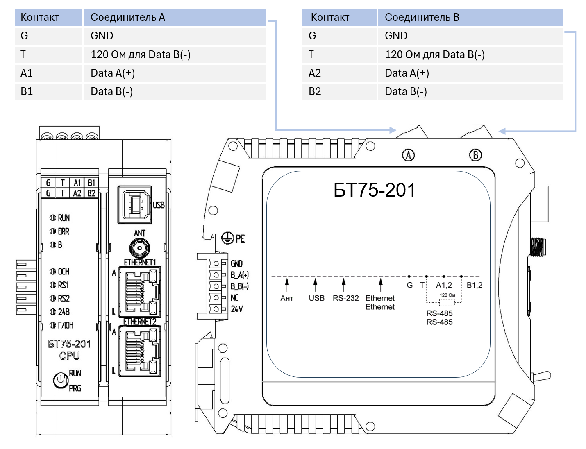

# Модуль процессорный БТ75-201 
## Технические характеристики

=== "Процессор и память"   
    !!! info "Процессор и память"   
        - Микропроцессор - 1890ВМ108    
        - Частота микропроцессора - 200  МГц        
        - ОЗУ - DDR3, не менее 256 Мбайт                                       
        - ППЗУ - не менее 16 Мбайт 
        - ППЗУ NAND - 256 Мбайт          
        - Встроенные часы реального времени - есть                           
        - Календарь - есть                                              

=== "Коммуникационные интерфейсы"
    !!! info "Коммуникационные интерфейсы" 
        - Интерфейс Ethernet 10/100 Base-TХ - 2          
        - Технологический интерфейс USB 2.0 - 1          
        - RS-485 для подключения внешних абонентов - 2          
        - RS-485 для подключения модуля на общую внутреннюю шину - 1          
        - Антенна для подключения модуля GPS/ГЛОНАСС - 1      
   
=== "Источник питания" 
    !!! info "Источник питания"
        - Напряжение питания - 24 В             
        - Потребляемая мощность - не более 15,6 Вт  
   
=== "Габаритные размеры" 
    !!! info "Габаритные размеры"
        - Без учета шинного соединителя - 45,2х103,5х119  мм    
        - С учетом шинного соединителя - 51,8х103,5х119  мм   
        - Масса изделия - не более 0,19 кг  

## Внешние подключения

## Описание модуля

Модуль **БТ75-201** состоит из двух основных функциональных узлов:

- процессорная плата - содержит микропроцессор 1890ВМ108, микросхемы ОЗУ и ППЗУ, подсистему индикации и управления, устройство связи ГЛОНАСС, 
электронные компоненты для подключения интерфейсов ETHERNET и USB, источники питания, формирующие необходимые напряжения для функционирования модуля.
- узел, обеспечивающий обмен данными микропроцессора по системным шинам. В его состав входят электронные компоненты для подключения интерфейсов каналов RS-485.

Электропитание на модуль подается с модуля питания **БТ75-001** посредством шины питания.

На передней панели модуля расположены:

- индикаторы "RUN", "ERR", "B" -  отражают текущее состояние модуля;
- индикаторы "ОСН", "RS1", " RS2", "24В", "ГЛОН" - отражают состояние системы питания модуля, его режим работы, наличие обменов по интерфейсам RS-485;
- разъемы для подключения внешних электрических цепей к интерфейсам USB, Ethernet, устройства связи ГЛОНАСС «ANT».

На верхней панели модуля распологаются соединители А и В для подключения внешних электрических цепей к интерфейсам RS-485.

На задней панели модуля расположен соединитель, предназначенный для подключения модуля к шине питания и внутренним шинам данных.

## Таблица состояний индикаторов

<!DOCTYPE html>
<html>
<head>
    <title>Таблица индикаторов</title>
    
</head>
<body>
    <table>
        <colgroup>
            <col style="width: 10%">
            <col style="width: 25%">
            <col style="width: 25%">
            <col style="width: 40%">
        </colgroup>
        <thead>
            <tr>
                <th>Наименование индикатора</th>
                <th>Назначение индикатора</th>
                <th>Состояние индикатора</th>
                <th>Состояние модуля/канала</th>
            </tr>
        </thead>
        <tbody>
            <tr>
                <td><strong>24В</strong></td>
                <td>Индикация состояния входного напряжения</td>
                <td>Горит зеленым</td>
                <td>Входное напряжение на модуль подано</td>
            </tr>
            <tr>
                <td><strong>ГЛОН</strong></td>
                <td>Индикация состояния системы ГЛОНАСС</td>
                <td>Мигает зеленым</td>
                <td>Входное напряжение на модуль подано</td>
            </tr>
            <tr>
                <td><strong>ОСН</strong></td>
                <td>Индикация режима работы модуля</td>
                <td>Горит зеленым</td>
                <td>Модуль является основным модулем центрального процессора при работе в режиме резервирования</td>
            </tr>
            <tr>
                <td></td>
                <td></td>
                <td>Погашен</td>
                <td>Модуль является резервным модулем центрального процессора при работе в режиме резервирования или режим резервирования не включен</td>
            </tr>
            <tr>
                <td><strong>RS1, RS2</strong></td>
                <td>Наличие обмена по каналам RS-485</td>
                <td>Мигает зеленым</td>
                <td>Модуль осуществляет обмен данными (прием или передача) по соответствующему каналу RS-485</td>
            </tr>
            <tr>
                <td><strong>RUN</strong></td>
                <td>Индикация статуса модуля</td>
                <td>Мигает зеленым</td>
                <td>Модуль исполняет программу пользователя</td>
            </tr>
            <tr>
                <td><strong>ERR</strong></td>
                <td>Индикация исправности модуля</td>
                <td>Горит красным</td>
                <td>Модуль неисправен</td>
            </tr>
            <tr>
                <td><strong>B</strong></td>
                <td>Наличие обмена по внутренним шинам данных</td>
                <td>Мигает зеленым</td>
                <td>Модуль осуществляет обмен данными (прием или передача) по внутренней шине данных</td>
            </tr>
        </tbody>
    </table>
</body>
</html>
    

